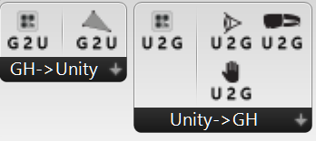
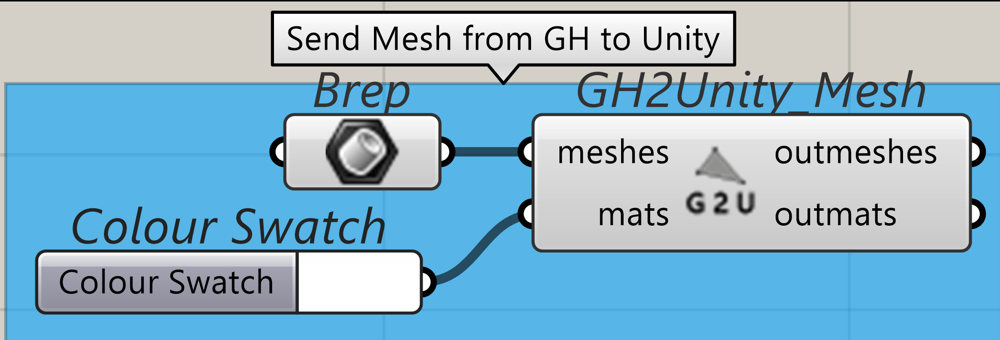
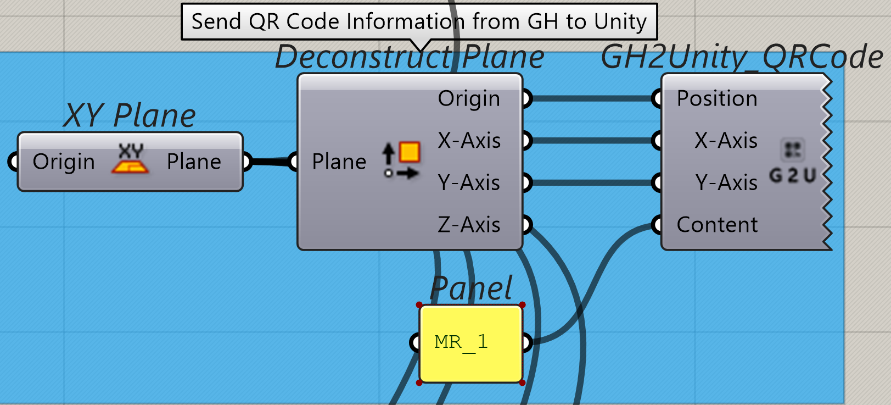
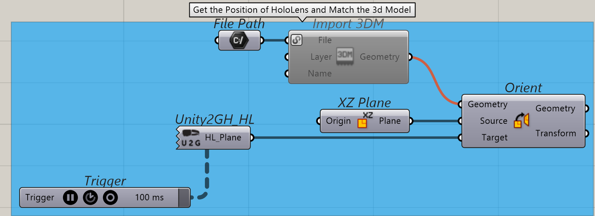
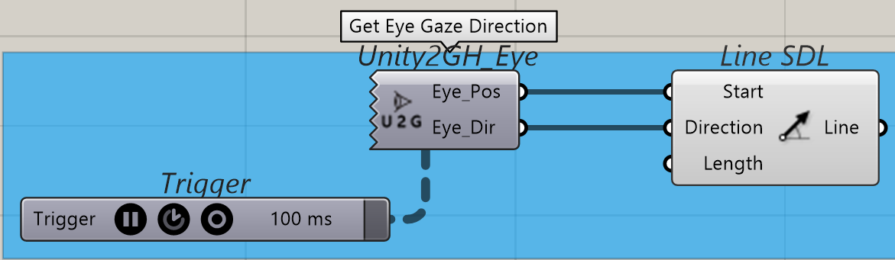
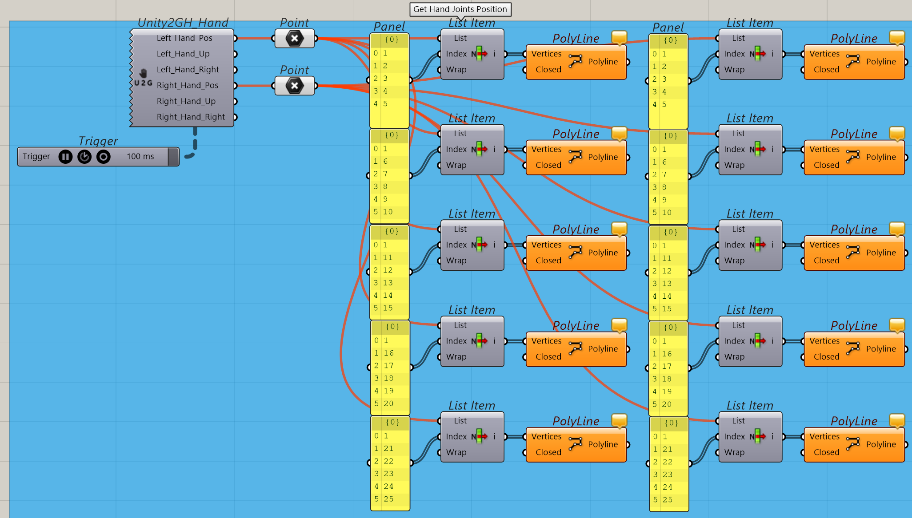
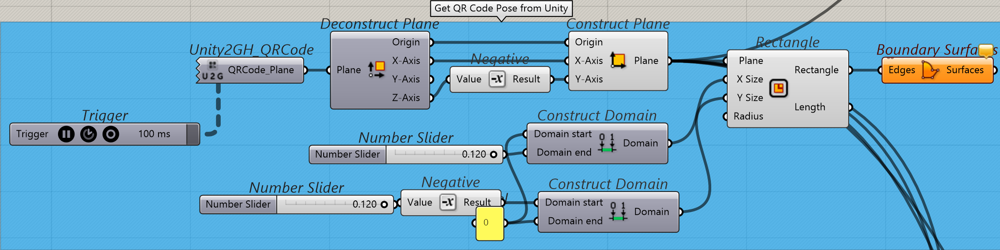
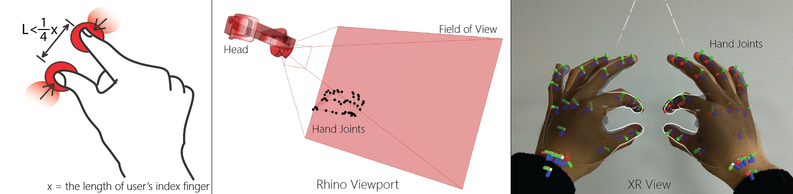
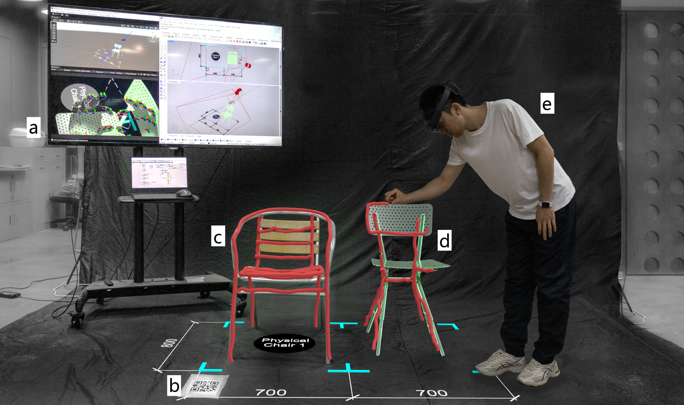

# Overview
The HoloLens Sync plugin for Grasshopper consists of 6 components.

In the "GH->Unity" category, it can send the mesh model and the 6-DoF pose of QR Code from Rhino to Unity.

In the "Unity->GH" category, it can get the 6-DoF pose of HoloLens, eye gaze, and hand joints from Unity.

# Features

1. Display the HoloLens, EyeGaze, and HandJoints.

2. Display mesh models in the HoloLens view.

# Sample

Note: The sample GH files `HL-Unity-GH(with QR Code).gh` and `HL-Unity-GH(withouot QR Code).gh` should be used together with the Unity project in `Unity_Project_RIU+MR` folder. Ensure that the following modules are added to the project: `MRTK3`, `OpenXR`, `Microsoft.MixedReality.QR`, and `Microsoft.VCRTForwarders`.